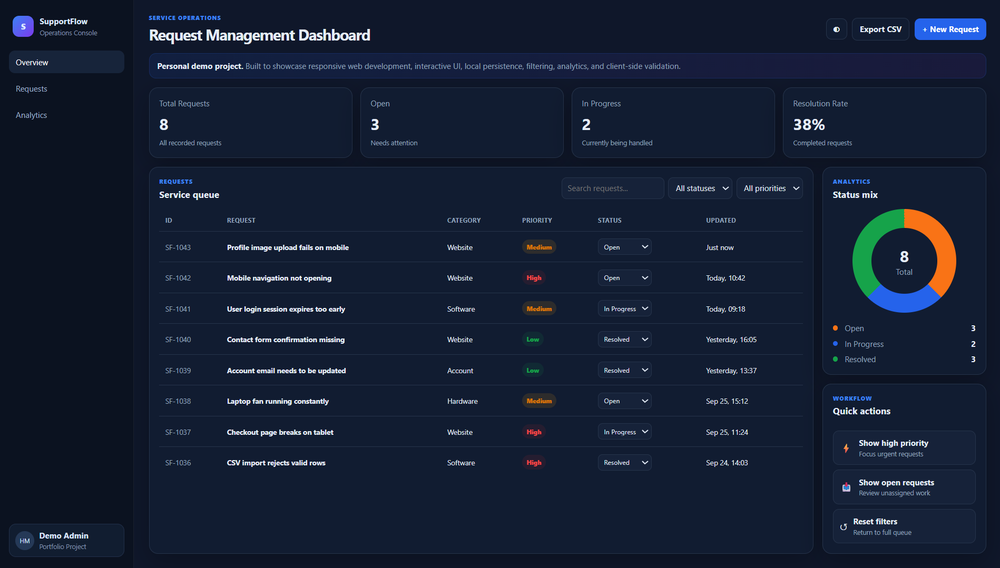
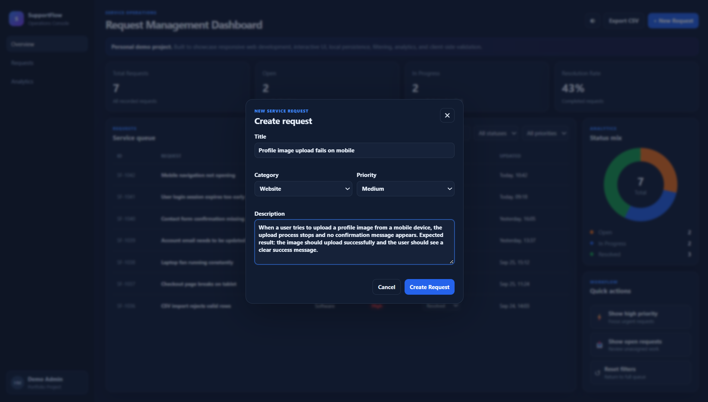
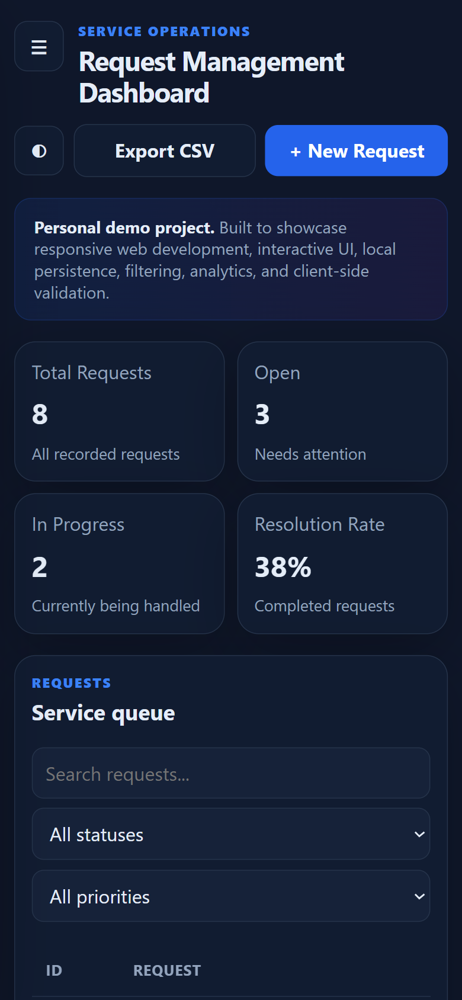

# SupportFlow — Service Request Management Dashboard

A responsive service request management dashboard built with HTML, CSS, and JavaScript.

**Live Demo:** https://ahamedhasheer.github.io/supportflow/

> Personal demonstration project created to showcase front-end development, responsive design, interactive UI, client-side validation, local persistence, and software testing.

## Preview

### Desktop Dashboard

### Create Request

### Mobile Responsive View

## Features

- Responsive desktop, tablet, and mobile dashboard
- Create and manage service requests
- Search requests
- Filter by status and priority
- Update request status dynamically
- KPI summary cards
- Dynamic request status chart
- Browser LocalStorage persistence
- CSV export
- Dark and light themes
- Client-side form validation
- Mobile off-canvas navigation
- Accessible labels and keyboard-friendly interactions
- Zero external libraries or frameworks

## Technologies

- HTML5
- CSS3
- JavaScript
- LocalStorage
- Responsive Web Design

## Project Purpose

SupportFlow demonstrates the type of internal dashboard a support or operations team could use to manage incoming service requests.

The project focuses on practical front-end development concepts including:

- structured dashboard layouts
- reusable interface components
- state management in JavaScript
- data filtering and searching
- persistent browser storage
- form validation
- responsive design
- basic accessibility
- functional testing

## Testing

The project was tested for:

- request creation
- required-field validation
- search functionality
- status filtering
- priority filtering
- status updates
- LocalStorage persistence after refresh
- CSV export
- dark/light theme switching
- responsive mobile layouts

See `QA_CHECKLIST.md` for the testing checklist.

## Run Locally

1. Download or clone the repository.
2. Open `index.html` in a modern browser.

No installation or external dependencies are required.

## Portfolio Disclosure

This is a personal demonstration project.

The support requests, users, statistics, and operational information displayed in the application are fictional and are included only to demonstrate application functionality.
